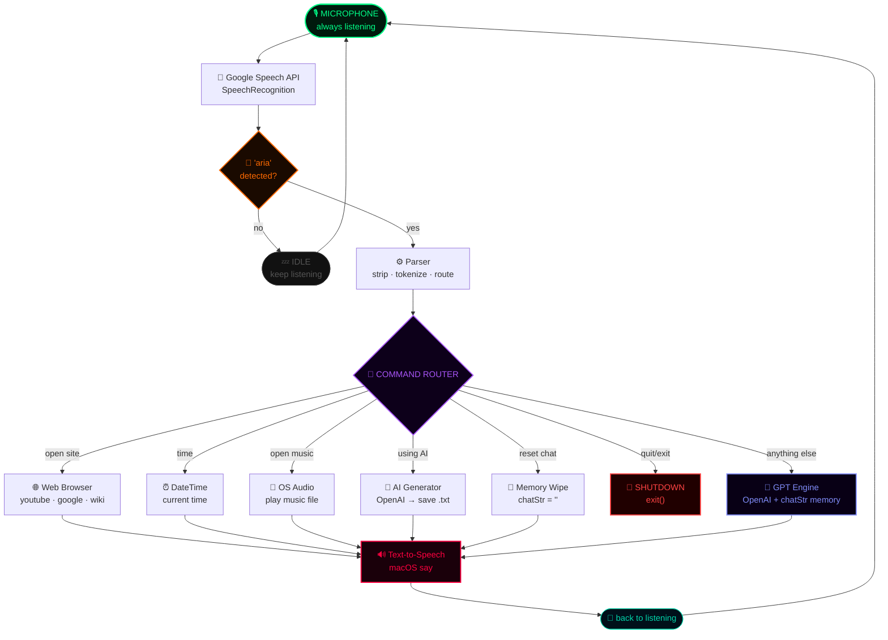
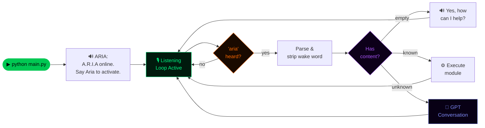
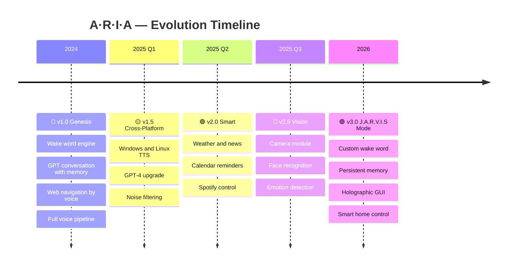

<a name="top"></a>

<div align="center">

<br/>

# 🔴 &nbsp; A &nbsp;·&nbsp; R &nbsp;·&nbsp; I &nbsp;·&nbsp; A &nbsp; 🔴

### `Artificial · Responsive · Intelligent · Assistant`

<br/>

> **She hears you. She thinks. She speaks. She acts.**
> *Inspired by J.A.R.V.I.S — built for your terminal.*

<br/>


<br/>

[](https://python.org)
[](https://openai.com)
[](/)
[](LICENSE)

</div>

---

<div align="center">

## ⚡ SYSTEM BOOT

</div>

```
          ┌─────────────────────────────────────────────────────────────────────┐
          │                                                                     │
          │   01  Speech recognition  ................................ ONLINE   │
          │   02  OpenAI neural core  ................................ ONLINE   │
          │   03  Text-to-speech engine  ............................. ONLINE   │
          │   04  Wake word → "ARIA"  ................................ ARMED    │
          │   05  Command router  ..................................... READY   │
          │                                                                     │
          │          🔴  A.R.I.A IS LIVE — SAY HER NAME  🔴                    │
          │                                                                     │
          └─────────────────────────────────────────────────────────────────────┘
```

---

<div align="center">

## 🤖 WHAT IS A.R.I.A ?

</div>

<div align="center">

| | |
|:---:|:---|
| 🎙️ **She Listens** | Always active in the background — wakes up the instant she hears *"Aria"* |
| 🧠 **She Thinks** | Powered by OpenAI GPT with rolling conversation memory across the session |
| 🔊 **She Speaks** | Every reply is voiced out loud in real-time — no typing, no screens needed |
| 🌐 **She Navigates** | Opens YouTube, Google, Wikipedia and more — entirely by voice |
| 📝 **She Creates** | Generates AI-written content and saves it automatically to your disk |
| ⚡ **She Executes** | Play music, check time, reset memory, shut down — all voice-commanded |
| 🦾 **She's Inspired** | Built on the vision of **J.A.R.V.I.S** — Iron Man's legendary AI companion |

</div>

```
                    ┌──────────────────────────────────┐
                    │      YOU SAY  →  "ARIA..."       │
                    └────────────────┬─────────────────┘
                                     │
                    ┌────────────────▼─────────────────┐
                    │       🔴  ARIA WAKES UP  🔴     │
                    └────────────────┬─────────────────┘
                                     │
              ┌──────────────────────▼──────────────────────┐
              │   LISTENS  →  PROCESSES  →  UNDERSTANDS     │
              └──────────────────────┬──────────────────────┘
                                     │
              ┌──────────────────────▼──────────────────────┐
              │        SPEAKS BACK  +  TAKES ACTION         │
              └─────────────────────────────────────────────┘
```

---

<div align="center">

## ⚙️ CAPABILITY MATRIX

</div>

<div align="center">

| # | Module | What It Does | Powered By | Status |
|:---:|:---|:---|:---|:---:|
| `01` | 🎙️ **Voice Recognition** | Captures voice, converts to text in real time | `SpeechRecognition` + Google | 🟢 LIVE |
| `02` | 🔑 **Wake Word Engine** | Silent until *"Aria"* is spoken | Keyword parser | 🟢 LIVE |
| `03` | 🔊 **Text-to-Speech** | Speaks every response out loud | macOS `say` | 🟢 LIVE |
| `04` | 🧠 **GPT Conversation** | Full memory-aware multi-turn dialogue | OpenAI + `chatStr` | 🟢 LIVE |
| `05` | 🌐 **Web Navigator** | Opens YouTube · Google · Wikipedia | `webbrowser` | 🟢 LIVE |
| `06` | ⏰ **Time Announcer** | Reports current time when asked | `datetime` | 🟢 LIVE |
| `07` | 📝 **AI Content Gen** | Writes AI content and saves to disk | OpenAI + `os` | 🟢 LIVE |
| `08` | 🔁 **Memory Reset** | Wipes conversation history on command | `chatStr = ""` | 🟢 LIVE |
| `09` | 🛑 **Shutdown Protocol** | Clean exit via *"quit"* or *"exit"* | `exit()` | 🟢 LIVE |

</div>

---

<div align="center">

## 🏗️ SYSTEM ARCHITECTURE

</div>



---

<div align="center">

## 🎯 USE CASE MAP

</div>

<div align="center">

| 👤 User | 💻 Developer | ⚙️ System |
|:---|:---|:---|
| 🗣️ Chat with ARIA by voice | 🧪 Test OpenAI API via `openaitest.py` | 🧹 Wipe conversation memory |
| 🌐 Open websites hands-free | 🔑 Configure API key in `config.py` | 📊 Monitor system logs |
| ✍️ Generate AI written content | ⚙️ Extend commands in `main.py` | 🛑 Shut down ARIA cleanly |
| ⏰ Ask for the time | 🔧 Swap TTS engine for other platforms | 🔄 Restart listening loop |

</div>

---

<div align="center">

## 🔄 RUNTIME FLOW

</div>



---

<div align="center">

## 🚀 DEPLOY — 4 STEPS

</div>

### System Requirements

<div align="center">

| Component | Minimum | Recommended |
|:---|:---:|:---:|
| 🐍 Python | `3.8` | `3.10+` |
| 🖥️ OS | macOS 10.14 | macOS Ventura+ |
| 🎙️ Microphone | Any input | USB or built-in |
| 🌐 Internet | Required | Stable broadband |
| 🔑 OpenAI API Key | Valid key | GPT-4 tier |
| 🧠 RAM | 2 GB | 8 GB+ |

</div>

<br/>

**`STEP 01`** &nbsp;—&nbsp; Clone

```bash
git clone https://github.com/abhishekkashyap02/aria-ai-assistant.git
cd aria-ai-assistant
```

**`STEP 02`** &nbsp;—&nbsp; Install packages

```bash
pip install speechrecognition openai pyaudio
```

<div align="center">

| Package | Role |
|:---|:---|
| `speechrecognition` | Captures + transcribes voice via Google Speech API |
| `openai` | Drives conversation intelligence and content generation |
| `pyaudio` | Low-level microphone audio stream access |
| `os` · `webbrowser` · `datetime` | Python built-ins — no install needed |

</div>

> 💡 **macOS PyAudio fix:** `brew install portaudio && pip install pyaudio`
> 💡 **Windows:** Download `.whl` from [Unofficial Binaries](https://www.lfd.uci.edu/~gohlke/pythonlibs/#pyaudio)

**`STEP 03`** &nbsp;—&nbsp; Set your API key

```python
# config.py
apikey = "sk-xxxxxxxxxxxxxxxxxxxxxxxxxxxxxxxxxxxx"
```

> 🔒 Add `config.py` to `.gitignore` — never push API keys to GitHub.

**`STEP 04`** &nbsp;—&nbsp; Launch ARIA

```bash
python main.py
```

```
🔴  A.R.I.A. started
🔴  "A R I A online. Say Aria to activate me."
🔴  Listening...
```

**Say *"Aria"* — she's alive.**

---

<div align="center">

## 🎙️ VOICE COMMAND REFERENCE

</div>

<div align="center">

| 🎙️ You Say | ⚡ ARIA Does |
|:---|:---|
| *Aria, open YouTube* | Launches youtube.com in your browser |
| *Aria, open Google* | Launches google.com in your browser |
| *Aria, open Wikipedia* | Launches wikipedia.com in your browser |
| *Aria, open music* | Plays your local audio file |
| *Aria, what's the time* | Speaks the current time out loud |
| *Aria, [any question or topic]* | Starts a full GPT-powered conversation |
| *Aria, using artificial intelligence...* | Generates AI content and saves it to disk |
| *Aria, reset chat* | Wipes the full conversation memory |
| *Aria, quit* &nbsp;/&nbsp; *Aria, exit* | Graceful system shutdown |

</div>

---

<div align="center">

## 📁 PROJECT STRUCTURE

</div>

```
📦  A · R · I · A
│
├── 🧠  main.py             ←  core loop · command router · AI engine
├── 🔐  config.py           ←  OpenAI API key  ⚠️ add to .gitignore
├── 🧪  openaitest.py       ←  standalone OpenAI API validation script
│
├── 📂  Openai/             ←  auto-created · AI generated output files
│   ├── prompt_12345.txt
│   └── prompt_67890.txt
│
├── 🚫  .gitignore
└── 📖  README.md
```

---

<div align="center">

## 📊 PERFORMANCE

</div>

<div align="center">

| Module | Condition | Speed | Score |
|:---|:---|:---:|:---:|
| 🎙️ Voice Capture | Quiet room, clear speech | `~0.5s` | 🔴🔴🔴🔴🔴 |
| 📡 Speech Recognition | Google API, en-IN | `~1–2s` | 🔴🔴🔴🔴🟠 |
| 🧠 GPT Response | 256 token completion | `~2–4s` | 🔴🔴🔴🔴🟠 |
| 🌐 Browser Open | Default browser | `< 1s` | 🔴🔴🔴🔴🔴 |
| 📝 Content Save | Generate + write disk | `~3s` | 🔴🔴🔴🔴🟠 |
| 🔊 TTS Playback | macOS `say` engine | `real-time` | 🔴🔴🔴🔴🔴 |

</div>

---

<div align="center">

## ⚠️ LIMITATIONS

</div>

<div align="center">

| Flag | Issue | Fix |
|:---:|:---|:---|
| 🍎 | macOS TTS only | Replace `say` with `pyttsx3` or `gTTS` |
| 🌐 | Internet required | Google Speech + OpenAI need a connection |
| 🎙️ | Noise sensitive | Works best in a quiet environment |
| 💳 | API costs apply | Track usage at [platform.openai.com](https://platform.openai.com) |
| ⚠️ | Deprecated model | `text-davinci-003` retired — upgrade required |
| 🎵 | Hardcoded music path | Edit `musicPath` in `main.py` |

</div>

**Required API upgrade — use this instead:**

```python
response = openai.ChatCompletion.create(
    model="gpt-3.5-turbo",
    messages=[{"role": "user", "content": query}]
)
reply = response["choices"][0]["message"]["content"].strip()
```

---

<div align="center">

## 🔮 ROADMAP

</div>



<div align="center">

| | Feature |
|:---:|:---|
| ✅ | Wake word voice activation |
| ✅ | GPT multi-turn conversation with memory |
| ✅ | Web browser navigation by voice |
| ✅ | Real-time time announcements |
| ✅ | AI content generation and auto-save |
| ✅ | Chat history reset on command |
| 🔲 | Cross-platform TTS — Windows and Linux |
| 🔲 | Spotify and music streaming control |
| 🔲 | Weather and daily news briefings |
| 🔲 | Calendar and reminder integration |
| 🔲 | Vision — camera, face and object recognition |
| 🔲 | Custom wake word training |
| 🔲 | Long-term persistent memory |
| 🔲 | Holographic GUI |

</div>

---

<div align="center">

## 📄 LICENSE

```
MIT License  ·  Copyright © 2025 Abhishek Kashyap

Free to use · modify · distribute · sell
Provided "as is" — no warranties.
```

</div>

---

<div align="center">

## 🙏 CREDITS

| | |
|:---:|:---|
| 🤖 | **OpenAI** — The neural intelligence powering ARIA's brain |
| 🎙️ | **Google Speech API** — Real-time voice transcription |
| 🐍 | **Python Community** — The open-source foundation |
| 🦾 | **Tony Stark** — The visionary who made us dream of this |
| 🌐 | **Open Source World** — Every library that made this possible |

</div>

---

<div align="center">

## 👾 THE CREATOR

<br/>

<table>
<tr>
<td align="center" width="120">


</td>
<td align="left" width="380">

### Abhishek Kashyap

[](mailto:kashyapabhishek0212@gmail.com)

[](https://github.com/abhishekkashyap02)

[](https://github.com/abhishekkashyap02/aria-ai-assistant)

</td>
</tr>
</table>

</div>

---

<div align="center">

<br/>

### *" I am Iron Man. "*
**— Tony Stark**

*A.R.I.A is his voice — now running in your terminal.*

<br/>

<a href="#top"></a>

<br/><br/>

[](https://github.com/abhishekkashyap02/aria-ai-assistant)
&nbsp;
[](https://github.com/abhishekkashyap02/aria-ai-assistant/fork)
&nbsp;
[](https://github.com/abhishekkashyap02/aria-ai-assistant/issues)

<br/>

**Made with ❤️ by Abhishek Kashyap**
<br/>
*Inspired by Iron Man · Powered by Python · Activated by Voice*

<br/>

</div>
